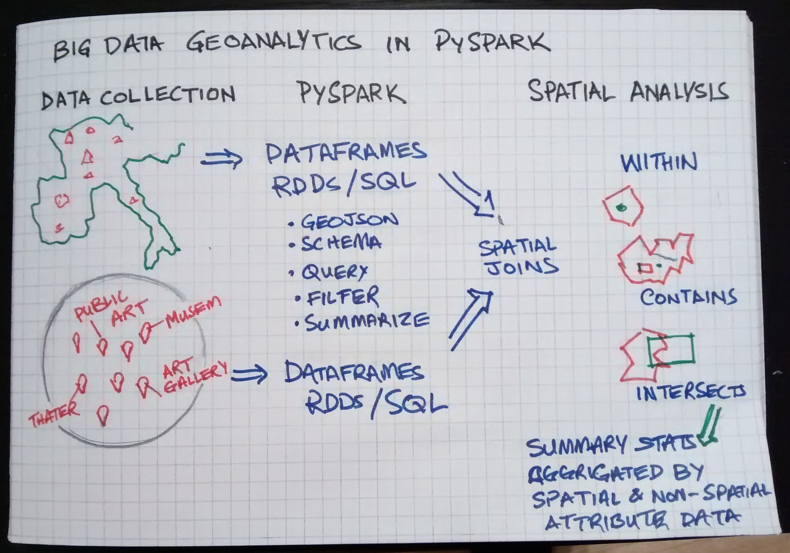
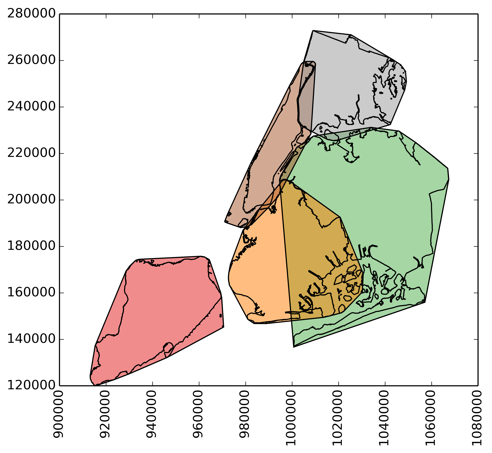

# Workshop Geospatial Analysis with PySpark

## Shoaib Burq
### @sabman

^ Thank everyone for coming
^ Introduce myself

---

## About me

Shoaib Burq (twitter: @sabman)

* :school: Geomatics Engineer and Software Developer
* :whale: Underwater mapping & ...
* :fire: Disaster Response work for Australian Gov.
* :airplane:: Moved to Berlin 2011
* :sweat: Startup with some awesome people (dataX)

---

# [fit] :school: datax.academy

---

## Team dataX

* Stafan Berntheisel (big data engineer)
* Dr Kashif Rasul (deep learning)
* Sergey Vandyshev (machine learning)
* Leo Marose (business/analyst)

---

# [fit] Getting Setup :v:

---

## Docker

* Download the docker image
* docker up

---

# [fit] Big Picture :cloud:

---



---

# [fit] :globe_with_meridians: + :panda_face: = GeoPandas

## http://geopandas.org

---

## Make working with geographic data like working with other kinds of data in python

Work with existing tools:

* Desktop GIS (ArcGIS, QGIS)
* Geospatial databases (e.g., PostGIS)
* Web maps (Leaflet, D3, etc.)
* Python data tools (pandas, numpy, etc.)

---

## Supports

* Geometry operations (Shapely)
* Data alignment (pandas)
* Coordinate transformations (pyproj)
* Read/write GIS file formats (Fiona)
* Create a GeoDataFrame from PostGIS table
* Output any object as geoJSON
* Plotting

---

## GeoPandas depends on

* Python (2.6, 2.7, 3.3+)
* Pandas (0.13 and up)
* Shapely (GEOS)
* Fiona (GDAL/OGR)
* Pyproj (PROJ.4)
* Matplotlib (and Descartes)
* psycopg2, sqlalchemy, geopy, rtree (optional)

---

## It can do

* Geometry operations (Shapely)
* Data alignment (pandas)
* Coordinate transformations (pyproj)
* Read/write GIS file formats (Fiona)
* Create a GeoDataFrame from PostGIS table
* Output any object as geoJSON
* Plotting

---

##GeoPandas Data Structures

### Pandas :arrow_right: GeoPandas

* Series (1-D) :arrow_right: GeoSeries (1-D)
* DataFrame (2-D table) :arrow_right: GeoDataFrame (2-D)
* Panel (3-D) :arrow_right: None Yet


---

## Loading data

```{python}
>>> boros = GeoDataFrame.from_file('nybb.shp') # also has from_postgis()
>>> boros.set_index('BoroCode', inplace=True)
>>> boros.sort()
              BoroName    Shape_Area     Shape_Leng  \
BoroCode
1             Manhattan  6.364422e+08  358532.956418
2                 Bronx  1.186804e+09  464517.890553
3              Brooklyn  1.959432e+09  726568.946340
4                Queens  3.049947e+09  861038.479299
5         Staten Island  1.623853e+09  330385.036974

                                                   geometry
BoroCode
1         (POLYGON ((981219.0557861328125000 188655.3157...
2         (POLYGON ((1012821.8057861328125000 229228.264...
3         (POLYGON ((1021176.4790039062500000 151374.796...
4         (POLYGON ((1029606.0765991210937500 156073.814...
5         (POLYGON ((970217.0223999023437500 145643.3322...
```

---

## Plotting


```{python}
boros.plot()
```

---

## Convex Hull



```{python}
boros.convex_hull.plot()
```

---

## Convex Hull


```{python}
boros.buffer(0.5).plot()
```

---

## Convex Hull


```{python}
boros.buffer(0.5).plot()
```

---
## Output to GeoJSON


```{python}
boros.to_json()
```
